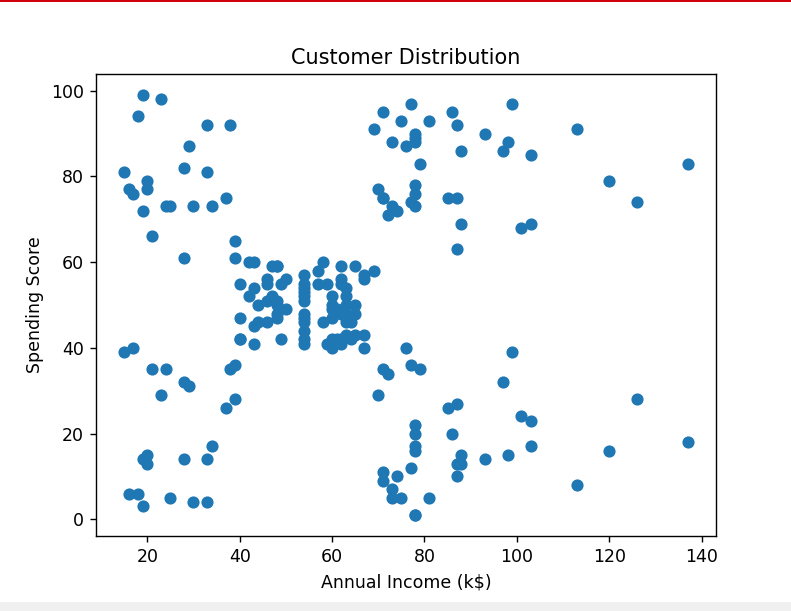
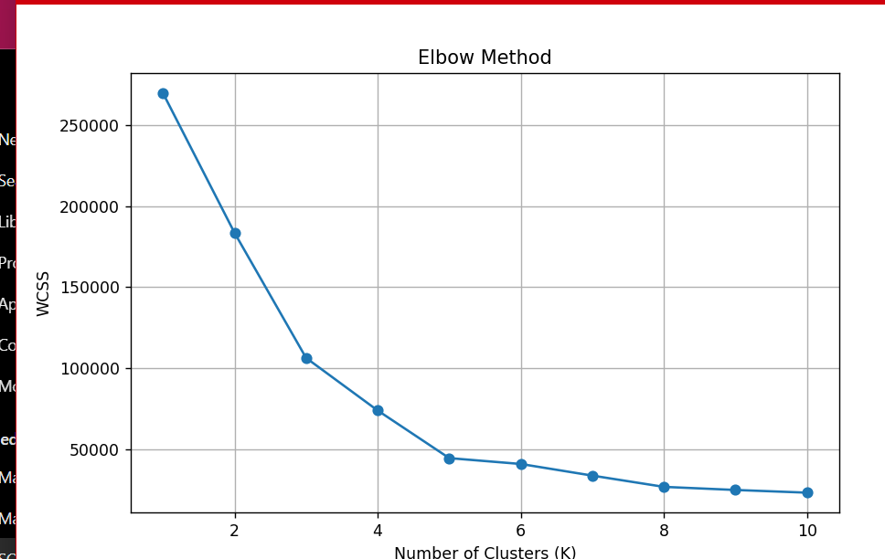
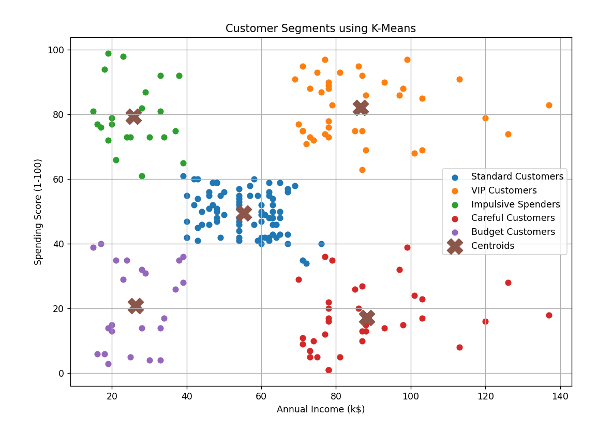

# Customer Segmentation using K-Means Clustering

## Overview

This project uses K-Means Clustering to segment mall customers based on their annual income and spending behavior. The goal is to identify meaningful customer groups and generate actionable business insights that can support marketing and customer retention strategies.

The project includes:

- Exploratory Data Analysis (EDA)
- Customer Segmentation using K-Means
- Elbow Method for selecting optimal clusters
- Silhouette Score evaluation
- Cluster Profiling and Business Insights
- SQL Integration using SQLite
- Interactive Streamlit Dashboard
- Customer Segment Prediction

---

## Dataset

Dataset: Mall Customers Dataset

Features:

- CustomerID
- Gender
- Age
- Annual Income (k$)
- Spending Score (1-100)

---

## Project Workflow

### 1. Data Exploration

- Dataset inspection
- Missing value analysis
- Summary statistics
- Correlation analysis
- Scatter plot visualization

### 2. K-Means Clustering

- Selected features:
  - Annual Income (k$)
  - Spending Score (1-100)
- Elbow Method used to determine optimal K
- Chosen number of clusters: 5

### 3. Cluster Evaluation

Silhouette Score:

```text
0.5539
```

This indicates reasonably well-separated customer segments.

### 4. Customer Segments Identified

| Segment             | Description                      |
| ------------------- | -------------------------------- |
| VIP Customers       | High Income, High Spending       |
| Careful Customers   | High Income, Low Spending        |
| Impulsive Customers | Low Income, High Spending        |
| Budget Customers    | Low Income, Low Spending         |
| Standard Customers  | Average Income, Average Spending |

---

## Business Insights

### VIP Customers

- Premium memberships
- Exclusive offers
- Luxury product recommendations

### Careful Customers

- Personalized promotions
- Targeted marketing campaigns
- Cross-selling opportunities

### Impulsive Customers

- Loyalty programs
- Bundle deals
- Student discounts

### Budget Customers

- Discount-focused campaigns
- Affordable product recommendations

### Standard Customers

- General promotions
- Upselling opportunities

---

## Technologies Used

- Python
- Pandas
- NumPy
- Scikit-Learn
- Matplotlib
- Plotly
- SQLite
- Streamlit

---

## SQL Integration

The project stores customer data in SQLite and performs analytical queries such as:

```sql
SELECT Cluster,
COUNT(*) AS Customers
FROM customers
GROUP BY Cluster;
```

```sql
SELECT Cluster,
AVG(`Annual Income (k$)`)
FROM customers
GROUP BY Cluster;
```

---

## Streamlit Dashboard Features

- Customer Segment Distribution
- Average Income by Segment
- Average Spending by Segment
- Interactive Customer Explorer
- Segment Summary Table
- Business Insights
- Customer Segment Predictor

---

## Installation

Clone the repository:

```bash
git clone https://github.com/YOUR_USERNAME/Customer-Segmentation.git
```

Move into the project directory:

```bash
cd Customer-Segmentation
```

Install dependencies:

```bash
pip install -r requirements.txt
```

Run the dashboard:

```bash
streamlit run app.py
```

---

## Project Structure

```text
Customer_Segmentation
│
├── data
│   ├── Mall_Customers.csv
│   └── segmented_customers.csv
│
├── app.py
├── main.py
├── sql_setup.py
├── test_sql.py
├── customers.db
├── requirements.txt
├── README.md
```

---

## Future Improvements

- Real-time customer segmentation
- Advanced clustering algorithms
- Customer Lifetime Value (CLV) analysis
- RFM Segmentation
- Dashboard deployment and monitoring

---

## Author

Mayukh Das

Second-Year Undergraduate, NIT Silchar

Interested in Machine Learning, Data Analytics, UI/UX, and Software Development.






